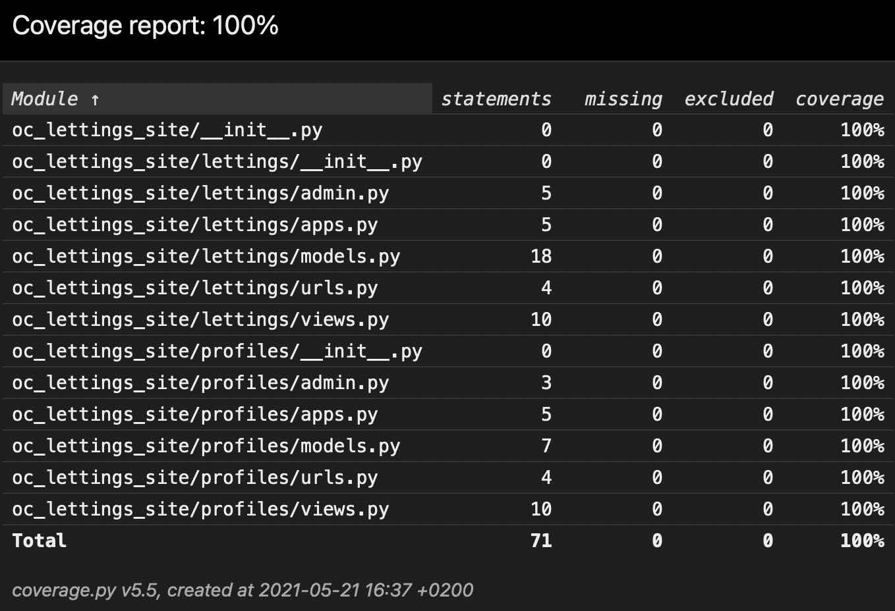

# ORANGE COUNTY LETTINGS

Openclassrooms - Parcours développement Python Projet 13

## Status

This project is ready for evaluation.

## Description

Orange County Lettings (OC Lettings) is a start-up specialized in real estate rental business. The start-up is in the midst of expansion in the United States.

This project consists in refactoring OC Lettings website application code and deploying it on Heroku using a container and a CI/CD pipeline. The website reflecting the result of the refactoring and deployment is available at the following address:

http://oc-lettings-2.herokuapp.com.


## Technical background

The project uses the following technologies:

* [Python](https://www.python.org) as the programming language
* [Django](https://www.djangoproject.com/) as a web framework
* [Pytest](https://pytest.org) and [Coverage](https://pypi.org/project/coverage/) for testing
* [Docker](https://www.docker.com) for containerization
* [CircleCI](https://www.circleci.com) for Continuous Integration
* [Heroku](https://www.heroku.com) for Deployment
* [Sentry](https://www.sentry.io) for monitoring

## Local Deployment

**Python 3** is required to run the website.

1. Clone this repository (or download the code [as a zip file](https://github.com/antoine71/OC-P13_OCLettings/archive/refs/heads/main.zip)), navigate to the root folder of the repository, create and activate a virtual environment, install project dependencies:

```
git clone https://github.com/antoine71/OC-P13_OCLettings.git
cd OC-P13_OCLettings
python -m venv env
source env/bin/activate
pip install -r requirements.txt
```

2. Run the server

```
$ python manage.py runserver
```

## Usage

The website is available from the following address:

```
http://localhost:8000/
```

## Administration

The application comes with an administration site.

```
http://localhost:8000/admin/
```

Only users with the status `superuser` can log in to the admin site.

The database comes with a pre-configured superuser account:

username: `admin`

password: `Abc1234!`

## Testing

The test suite can be run using the following command:

```
pytest
```

The coverage report can be generated using the following command:

```
coverage run -m pytest
```

The html report can be generated with the following command

```
coverage html
```

The report will be created in the subfolder `htmlcov/`.



## Local deployment using Docker CLI

The repository contains a `Dockerfile`that allows to easily build a Docker container and locally run the application. The same container can be used for deployement for production.

1. Download and install [Docker engine](https://docs.docker.com/engine/install/) according to your system requirement.

2. Navigate to the application root folder and build the container named `oc-lettings`:

```
docker build --platform linux/amd64 -t oc-lettings .
```

3. Run the container locally:

```
docker run --platform linux/amd64 -e DJANGO_SETTINGS_MODULE=config.settings.local -e PORT=8000 -p 127.0.0.1:8000:8000 oc-lettings:latest
```

The website can now be accessed locally from a web browser at `http://127.0.0.1:8000`

## Deployement using Heroku CLI

The application is pre-configured to be deployed on Heroku for production. This procedure assumes that you already have created locally a container named `oc-lettings` as described above.

1. Create a user account on [Heroku](https://www.heroku.com)
2. Download and install [Heroku CLI](https://devcenter.heroku.com/articles/heroku-cli#download-and-install)
3. Login and create a new Heroku app (replace `<app_name>` with the app name you choose)

```
heroku login
```

```
heroku apps:create <app_name>
```

4. Configure the Django secret key as an environment variable (replace `<your_secret_key>` with your secret key).

```
heroku config:set DJANGO_SECRET_KEY='<your_secret_key>' -a <app_name>
```

5. Retag the container as per the Heroku app name:

```
docker tag oc-lettings:latest registry.heroku.com/<app_name>/web:latest
```

6. Push the container and release the application:

Login to the Heroku container registry:

```
heroku container:login
```

Push the container and release the application:
```
docker push registry.heroku.com/<app_name>/web:latest
heroku container:release web -a <app_name>
```

7. You can now check the website from the following address: `https://<app_name>.herokuapp.com`.

## Deployment using CircleCI CI/CD Pipeline

The pipeline created for the project is available at the following address: <https://app.circleci.com/pipelines/github/antoine71/OC-P13_OCLettings>.

The repository container a configuration file for CircleCI : `.circleci/config.yml`. This files implements the following *workflow*:


* build:
  * builds a docker container image incorporating Python 3.9 based on [CircleCi legacy language images](https://circleci.com/docs/2.0/circleci-images/#legacy-language-images)
  * creates a virtual environment, install 3rd party packages required for the project.
  * saves the environment in the cache
* test:
  * builds the CircleCI Python 3.9 docker image and restore the environment from the cache
  * run the test suite using the command `pytest`
  * the testing starts only **after the job build is successfully completed**
* linting:
  * builds the CircleCI  Python 3.9 docker image and restore the environment from the cache
  * run the quality check using the command `flake8`
  * the linting starts only **after the job build is successfully completed**
* package:
  * builds the CircleCI  Python 3.9 docker image and restore the environment from the cache
  * builds a Docker container according to the requirements of the file `Dockerfile`
  * pushes the Docker container to the Dockerhub
  * the package job starts only **after the jobs test and linting are successfully completed**
* deploy:
  * pulls the Docker container previously build from the Dockerhub
  * tags the Docker container as required to push the container to the Heroku container registry
  * pushes the Docker container to the Heroku container registry
  * releases the Heroku application
  * the deploy job starts only **after the job deploy is successfully completed**  

The jobs *build, test, linting* are automatically performed everytime a new commit is pushed to the Github repository.

The *jobs package, deploy* are automatically performed everytime a **new commit of the branch main** is pushed to the Github repository.

## CircleCI Environment

The CircleCI project environment includes the following variables:

`DOCKER_USER`: the username of the Dockerhub where the container built by CircleCI is pushed

`DOCKER_ACCESS_TOKEN`: the access token corresponding to the username ([access token usage](https://docs.docker.com/docker-hub/access-tokens/) is recommended instead of password)

`HEROKU_APP_NAME`: the name of the Heroku application

`HEROKU_API_KEY`: the API key corresponding to the Heroku account

This variables shall be created as [environnement variables for the project](https://circleci.com/docs/2.0/env-vars/#setting-an-environment-variable-in-a-project) to run the pipeline on a different CircleCI repository, and modified as required to use different Docker or Heroku account or app name.

## Monitoring using Sentry

A simple surveillance process is implemented. The navigation to the page `/sentry-debug` will raise a server error that will be captured as an issue in a sentry project.


The project Data Source Name (DSN) shall be stored in the environment variable SENTRY_DSN in Heroku (replace <your_DSN> by your project DSN and <app_name> by the Heroku app name):

```
heroku config:set SENTRY_DSN='<your_DSN>' -a <app_name>
```

The sentry issue report is available at the following adress:
<https://sentry.io/share/issue/2eb30ffc626b4bebb06f05302691d997/>
